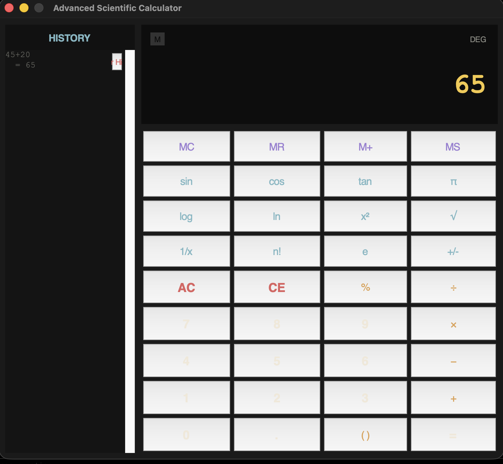

# 🧮 Advanced Scientific Calculator

> A feature-rich, dark-themed Scientific Calculator built with Python and Tkinter.  
> Portfolio-quality project demonstrating clean MVC architecture, keyboard bindings,  
> safe expression evaluation, memory operations, and scrollable history.

---

## 🌐 Live Demo
👉 *(Add your recorded demo / screenshot link here)*

---

## 📸 Preview


---

## 📋 Description

This calculator goes well beyond a basic four-function toy. It combines a robust `CalculatorEngine` (pure Python, zero UI dependencies) with a polished Tkinter interface inspired by industrial design — dark backgrounds, amber result highlights, and smooth hover/press animations. The engine uses Python's `eval` in a sandboxed namespace so scientific functions work safely without parsing a custom grammar.

---

## ✨ Features

### Core Operations
| Feature | Detail |
|---|---|
| **Arithmetic** | +, −, ×, ÷, integer division, modulo |
| **Power** | x², xⁿ (via ^ or **) |
| **Parentheses** | Smart toggle: auto-opens or closes based on context |
| **Decimal** | Full float precision (`.`) |

### Scientific Functions
| Function | Input Mode |
|---|---|
| √x | Applies to current expression |
| sin / cos / tan | Degrees input |
| log (base-10) / ln | Applies to current expression |
| n! (factorial) | Integer input |
| 1/x (reciprocal) | Applies to current expression |
| π (pi) / e (Euler) | Constant injection |
| +/− (negate) | Toggle sign |
| % (percentage) | Divide by 100 |

### UI & UX
- **Keyboard bindings** for all digits, operators, Enter, Backspace, Delete, Escape
- **Live expression preview** – shows what you're building before evaluating
- **Scrollable history panel** – double-click any result to recall it
- **Memory bank** – MS / MR / M+ / MC with visual memory indicator badge
- **Error handling** – graceful messages auto-dismiss after 3 seconds
- **ANS chaining** – after a result, typing an operator continues from the answer
- **Dark industrial theme** with amber accent and hover animations

---

## 🛠 Tech Stack

- **Language**: Python 3.10+
- **UI Library**: Tkinter (stdlib – zero extra dependencies)
- **Testing**: `unittest` (stdlib)
- **Architecture**: Engine / UI separation (MVC-inspired)

---

## 📁 Project Structure

```
advanced_calculator/
├── calculator_app.py         # Tkinter UI layer – CalculatorApp class
├── calculator_engine.py      # Pure logic engine – CalculatorEngine class
├── test_calculator_engine.py # 30+ unit tests for the engine
├── screenshot.png            # Application screenshot
└── README.md                 # This file
```

---

## 🚀 How to Run

### Prerequisites
- Python 3.10 or higher
- Tkinter (included with most Python installations)

```bash
# Verify Python version
python --version   # Needs 3.10+

# Verify Tkinter is available
python -c "import tkinter; print('Tkinter OK')"
```

### Linux – Install Tkinter if missing
```bash
# Ubuntu/Debian
sudo apt-get install python3-tk

# Fedora
sudo dnf install python3-tkinter

# Arch
sudo pacman -S tk
```

### Run the Calculator

```bash
cd advanced_calculator
python calculator_app.py
```

### Run the Tests

```bash
# With unittest directly
python -m unittest test_calculator_engine.py -v

# With pytest (if installed)
pip install pytest
pytest test_calculator_engine.py -v
```

---

## ⌨️ Keyboard Shortcuts

| Key(s) | Action |
|---|---|
| `0–9` | Digit input |
| `+` `-` `*` `/` | Arithmetic operators |
| `^` | Power (x^n) |
| `%` | Percentage |
| `(` `)` | Parentheses |
| `.` | Decimal point |
| `Enter` / `Numpad Enter` | Evaluate (=) |
| `Backspace` | Delete last character (CE) |
| `Delete` | Clear all (AC) |
| `Escape` | Clear all (AC) |
| `Ctrl+H` | Clear history |

---

## 🏗 Architecture

```
calculator_engine.py          ← Pure computation, no UI
│   CalculatorEngine
│   ├── append(token)          ← Build expression
│   ├── evaluate()             ← Safe eval with sandboxed namespace
│   ├── clear_all / clear_entry
│   ├── apply_sqrt / sin / cos / tan / log / ln / square / inverse / factorial
│   ├── apply_negate / apply_percent
│   ├── memory_store / recall / add / clear
│   └── get_history / clear_history

calculator_app.py             ← Tkinter UI
│   CalculatorApp
│   ├── _build_layout()        ← History pane + calc pane
│   ├── _build_display()       ← Memory indicator, expr label, result label
│   ├── _build_buttons()       ← Programmatic button grid from BUTTON_GRID spec
│   ├── _bind_keyboard()       ← Key bindings for every action
│   └── _handle_action(action) ← Central dispatcher → engine calls → display refresh
```

---

## 🔮 Future Improvements

- [ ] Unit converter mode (length, weight, temperature)
- [ ] Graphing mode using matplotlib embedding
- [ ] Custom themes / colour scheme switcher
- [ ] Equation history export (to `.txt` or `.csv`)
- [ ] Complex number support
- [ ] Radians / Degrees / Gradians toggle
- [ ] RPN (Reverse Polish Notation) mode
- [ ] Voice input via `speech_recognition`
- [ ] Multi-line expression editor with syntax highlighting

---

## 👨‍💻 Author

Built as a portfolio project demonstrating Python GUI development, clean architecture, and test-driven development practices.

---

## 📄 License

MIT License — free to use, modify, and distribute.
